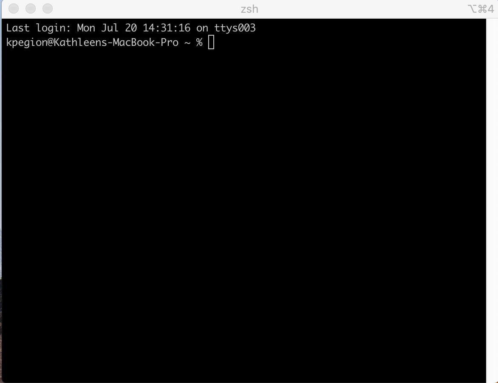

### Why do I need to login to another computer instead of using my own computer?
1. In atmosphere, ocean, and climate science most of our data analysis work is done on Unix or Linux computers. These types of computers have more computational capability, more memory, and more disk (or hard drive) space than a personal computer.  We need this to handle the many large datasets used in climate data analysis.  
2. COLA computers already contain many of the datasets we will work with.  These datasets are too large for your home computer and would take weeks to months to download. 
3. Unix computers use a command line interface that allow us to automate our data processing tasks much faster than a graphical user interface (GUI).  

### COLA Computers

The Center for Ocean-Land-Atmosphere Studies (COLA) in the Department of Atmospheric, Oceanic, and Earth Sciences (AOES) has Linux computers used to analysis of Climate Data.  They consist of cola1, cola2, cola3, ... , cola7.  These are the computers we will use in this class.  

### Setting up Software for your computer

To login to the COLA computers, you need secure shell (ssh) software. The software differs based on what type of computer you have. 

#### macOS
For a Mac computer, use software called [Xquartz](https://www.xquartz.org/)
#### Windows
For a Windows computer, use software called [MobusXterm](https://mobaxterm.mobatek.net/)
#### Linux
The default Unix Shell for Linux operating systems is usually Bash. On most versions of Linux, it is accessible by running the (Gnome) Terminal or (KDE) Konsole or xterm, which can be found via the applications menu or the search bar. If your machine is set up to use something other than Bash, you can run it by opening a terminal and typing `bash`.

> ## Download and install the correct ssh software for your computer
>
> Download the correct software for your computer 
>
> Follow the instructions on your computer to install the software
>
{: .challenge}

> ## In this class, you can
>
> - Raise your hand when you need assistance or have a question
>
> - Indicate you are done with this activity
>
{: .callout}

### Logging in

If you do not already have a COLA account, we will provide you with your username and password in class (if not before). The pre-course survey should have informed us whether you already have an account.

#### On macOS
Launch the XQuartz software you downloaded and select `Shell`-> `New Window` from the menu in the upper left.
A window will appear that looks something like (look may vary depending on version of macOS and/or some default settings in `Xquartz`):

To connect to the computer `cola1` , type the following and replace `username` with your assigned username:

~~~
$ ssh -Y -l username@cola1.gmu.edu
~~~
{: .language-bash}

Enter your password when prompted.
If this is the first time you have logged in, you will be required to change your password. 

#### On Windows
1. Launch the MobusXterm software you downloaded.  
2. Click `Session`->`SSH` 
3. In the `Remote host` box, enter `cola1.gmu.edu` 
4. Check the `Specify username` box and enter your `username`
5. Click OK
6. Enter your password when prompted
7. Select No when asked to save your password.  

If this is the first time you have logged in, you will be required to change your password.  

> ## Password Requirements & Policies
>
> * Password complexity
>   * 12 characters minimum
>   * Must contain characters from at least 3 of these 4 categories:
>     * Lowercase letters
>     * Uppercase letters
>     * Numbers
>     * Special characters (punctuation, symbols)
>     
> * Keep your password secure and in a safe place.
> * Do not share your password.
> * No one should ever ask you for your password.  If you ever get an email or other electronic message asking for your password DO NOT respond to it, it is a phishing attempt.
> * Do not store your password on your laptop in plain text. 
> * Passwords must be changed every 6-months. You will get an alert when it is time.
> * Follow the Mason [Responsible Use of Technology Policies] (https://universitypolicy.gmu.edu/policies/responsible-use-of-computing/)
>
{: .callout}

> ## Logging in to a different COLA computer
>
> COLA computers are cola1, cola2, cola3, ... , cola7
>
> Choose a computer other than cola1 and login to it.
>
{: .challenge}
